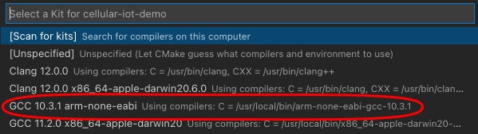

# Phantom Slayer for the Pimoroni PicoSystem

A retro-style 3D arcade game written in C++.

The original Phantom Slayer was created Ken Kalish for Med Systems. It was written in 6809 machine code for the Tandy Color Computer and was compatible with the Dragon 32 micro.

For more details on the game [see this page](https://smittytone.net/pico-phantoms/).

#### Requirements

* [Pimoroni PicoSystem](https://shop.pimoroni.com/products/picosystem).

### The Code

Build from source code, or copy `phantoms.uf2` to your PicoSystem. Please check the SHA 256:

```
SHA-256 TO ADD
```

### Build the Code

This code requires the installation of the [Pico SDK](https://github.com/raspberrypi/pico-sdk) and the [PicoSystem SDK](https://github.com/pimoroni/picosystem).

* Use Visual Studio Code with the [CMake](https://marketplace.visualstudio.com/items?itemName=twxs.cmake) and [CMakeTools](https://marketplace.visualstudio.com/items?itemName=ms-vscode.cmake-tools) extensions:
    1. Click **No active kit** to select your compiler, `GCC 10.3.1 arm-none-eabi`:<br />
    1. Click **Build**:<br />
* From the command line:
    1. `cd <YOUR_GIT_DIRECTORY>/pico-system-phantoms`
    1. `cmake -S . -B build/`
    1. `cmake --build build --clean-first`

### The Game

See [this blog post for full details](https://blog.smittytone.net/2021/03/26/3d-arcade-action-courtesy-of-raspberry-pi-pico/).

### Credits

This games is based on a 1982 original created by Ken Kalish of Med Systems for the Tandy Color Computer. The design is Ken’s; the code is mine, and I’ve taken only a few liberties with certain gameplay and visual details.